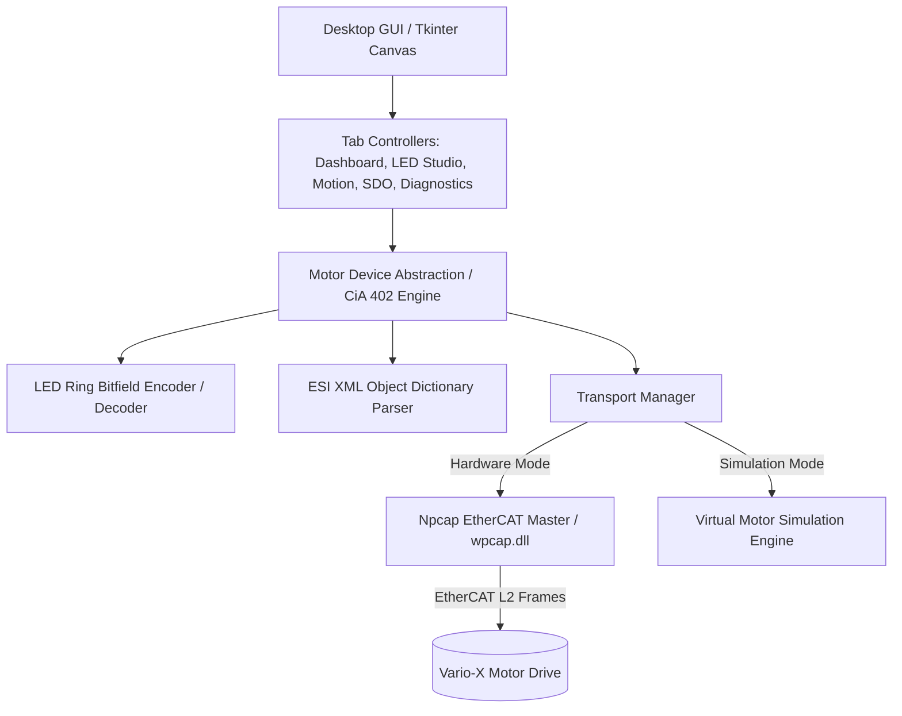

# AgenticRef — Vario-X EtherCAT Motor Drive Diagnostic & LED Color Ring Studio

> **Purpose of this document:** A single, formal, local-only reference that any agent
> (or human) working on this project reads first to stay aligned on *what* this
> application is, *why* it exists, *how* it is built, and *what rules* govern changes.
> This file is excluded from public source control and serves as the single source of truth.
>
> **Maintenance rule:** Keep this file current. When a module is added/renamed, a rule
> changes, or a feature ships, update the relevant section in the same change.

- **Application:** Vario-X EtherCAT Motor Drive Diagnostic & LED Color Ring Studio (`variox-motor-studio`)
- **Current Version:** 1.0.0
- **Owner:** US Solutions Team, Murrelektronik GmbH
- **Target Device/Platform:** Windows 10/11 x64, Murrelektronik Vario-X MotorDrive (V000-MDDC0-0000001) over EtherCAT (CoE / EtherType 0x88A4), Npcap Packet Capture Engine.

---

## Project Goals

### Core Objective
- Provide an engineering desktop tool and diagnostic GUI for commissioning, parameterizing, and controlling the **Murrelektronik Vario-X Motor Drive** over EtherCAT.
- Deliver an interactive **LED Color Ring Studio** with full control over the 32-bit optical status ring (`0x2FEF:01` / `0x2FEF:02`), pattern generators, quick presets, and live visual animation.
- Offer live CiA 402 drive monitoring (Statusword, Controlword, Modes of Operation, Position, Velocity, Torque, DC Bus Voltage, STO status, temperatures) and an interactive SDO Object Dictionary explorer parsed directly from ESI XML files.
- Enable zero-hardware testing via a built-in virtual motor simulation engine with high-fidelity physical and protocol emulation.

### High-Level Requirements
- **Protocol Transparency:** Direct Layer-2 EtherCAT framing over Npcap (`wpcap.dll`), supporting Mailbox CoE (CAN Application Protocol over EtherCAT) SDO upload/download and cyclic PDO data streams.
- **ESI Integration:** Dynamic parsing of `Vario-X MotorDrive_240828.xml` and `Vario-X Drive.xml` to automatically discover all 140+ object dictionary entries, data types, bit lengths, and PDO configurations.
- **LED Ring Control:** Complete encoding/decoding of the 32-bit `0x2FEF` structure (Left/Right halves, Red/Yellow/Green channels, 16 blinking/flashing patterns, priority rules, Driver vs. User modes).
- **Dual Execution Engine:** Seamless switching between physical Npcap network adapters and the high-fidelity offline virtual motor simulator.

---

## Project Rules

### Development Standards
- **Language & Runtime:** Python 3.10+ with standard library and `ctypes` bindings for `wpcap.dll`.
- **GUI Framework:** Python Tkinter with custom anti-aliased Canvas rendering and modern dark emerald theme (`gui/theme.py`).
- **Safety Interlocks:** Clear visual indication of drive state (Switch On Disabled, Ready to Switch On, Switched On, Operation Enabled, Quick Stop, Fault). Homing, jog, and target movements require explicit drive enable.
- **Testing:** Comprehensive unit test suite (`tests/`) covering codecs, LED ring bit arithmetic, ESI parsing, and simulator physics.

---

## Technical Architecture



### System Components
1. **`core/ecat_raw.py`**: Raw EtherCAT datagram framing (BRD, BWR, APRD, APWR, FPRD, FPWR, LRD, LWR, EtherType 0x88A4).
2. **`core/ecat_master.py`**: EtherCAT Master state machine (Init, Pre-Op, Safe-Op, Op), SyncManager mailbox initialization, CoE SDO upload/download, and background cyclic PDO streaming.
3. **`core/esi_parser.py`**: XML Parser for EtherCAT Slave Information files (`Vario-X MotorDrive_240828.xml`).
4. **`core/motor_device.py`**: CiA 402 drive state controller, statusword/controlword bit parsing, scaling for position, RPM, and torque.
5. **`core/led_ring.py`**: 32-bit `0x2FEF` LED Ring bitfield encoder/decoder, 16 blinking pattern engines, presets, and waveform calculators.
6. **`core/simulation.py`**: Real-time virtual motor simulator with trajectory generator, DC bus dynamics, STO logic, and CoE SDO/PDO responders.
7. **`gui/`**: Modern Dark Emerald industrial UI featuring interactive SVG-like circular motor ring graphics, multi-trace oscilloscope, gauges, and SDO tree.

---

## Domain & Protocol Reference

### 1. LED Ring Control Object (`0x2FEF`)
- **Index:** `0x2FEF:01` (Control Word, Read/Write, 32 bits), `0x2FEF:02` (Status Word, Read Only, 32 bits)
- **32-Bit Structure Layout:**
  ```
  Bit 31:      LED_mode (0 = Driver/Auto Mode, 1 = User/Manual Mode)
  Bits 30..24: Reserved (0)
  Bits 23..20: RRRR (Red Right Nibble)
  Bits 19..16: rrrr (Red Left Nibble)
  Bits 15..12: YYYY (Yellow Right Nibble)
  Bits 11..8:  yyyy (Yellow Left Nibble)
  Bits 7..4:   GGGG (Green Right Nibble)
  Bits 3..0:   gggg (Green Left Nibble)
  ```
- **Blinking Pattern Nibble Codes (0x0 to 0xF):**
  - `0x0`: Off
  - `0x1`: Solid On
  - `0x2`: 1s On, 1s Off
  - `0x3`: 1s Off, 1s On
  - `0x4`: 500ms On, 500ms Off (1 Hz)
  - `0x5`: 500ms Off, 500ms On
  - `0x6`: 250ms On, 250ms Off (2 Hz)
  - `0x7`: 250ms Off, 250ms On
  - `0x8`: 125ms pulse every 1s (Single Flash 1 Hz)
  - `0x9`: 2x 125ms pulses every 1s (Double Flash 1 Hz)
  - `0xA`: 3x 125ms pulses every 1s (Triple Flash 1 Hz)
  - `0xB`: 125ms pulse every 500ms (Single Flash 2 Hz)
  - `0xC`: 125ms pulse every 500ms (125ms phase shift)
  - `0xD`: 125ms pulse every 500ms (250ms phase shift)
  - `0xE`: 125ms pulse every 500ms (375ms phase shift)
  - `0xF`: 125ms Off, 125ms On (Fast Strobe 4 Hz)
- **Priority Rule:** Red > Yellow > Green. If multiple colors are set simultaneously within the same half, the higher priority color overrides.

### 2. Key CoE Objects & Process Data (PDO)
- **TxPDO 0x1A00**:
  - `0x6041:00` Statusword (16 bits)
  - `0x6061:00` Modes of Operation Display (8 bits)
  - `0x6064:00` Position Actual Value (32 bits, signed)
  - `0x606C:00` Velocity Actual Value (32 bits, signed)
  - `0x6077:00` Torque Actual Value (16 bits, signed)
  - `0x6079:00` Real DC Bus Voltage (32 bits, mV)
  - `0x2FEF:02` LED Status Word (32 bits)
  - `0x60F4:00` Following Error Actual Value (32 bits)
- **TxPDO 0x1A01**:
  - `0x60F7:17` STO Status (16 bits)
  - `0x60F7:0B` Device Temperature (16 bits, 0.1 °C)
- **RxPDO 0x1600**:
  - `0x6040:00` Controlword (16 bits)
  - `0x6060:00` Modes of Operation (8 bits)
  - `0x6071:00` Target Torque (16 bits, signed)
  - `0x607A:00` Target Position (32 bits, signed)
  - `0x60FF:00` Target Velocity (32 bits, signed)
  - `0x2FEF:01` LED Control Word (32 bits)
  - `0x6072:00` Max Torque (16 bits)

### 3. CiA 402 Drive State Machine
- `0x0000` / `0x0006`: Shutdown -> Ready to Switch On
- `0x0007`: Switch On -> Switched On
- `0x000F`: Enable Operation -> Operation Enabled
- `0x0002`: Quick Stop -> Quick Stop Active
- `0x0080` (Rising edge bit 7): Fault Reset
