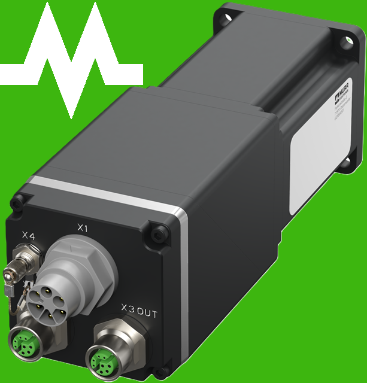
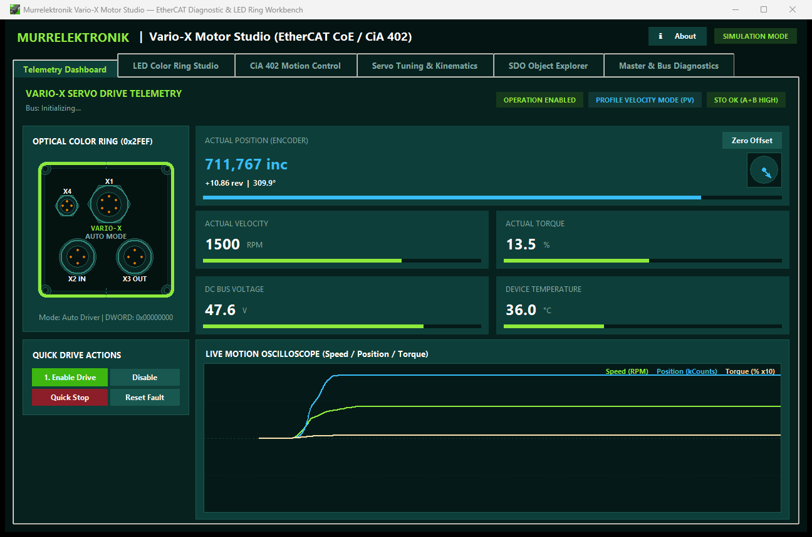
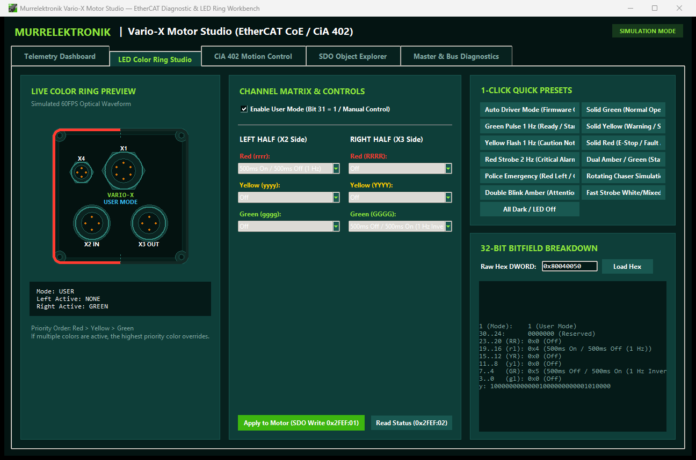
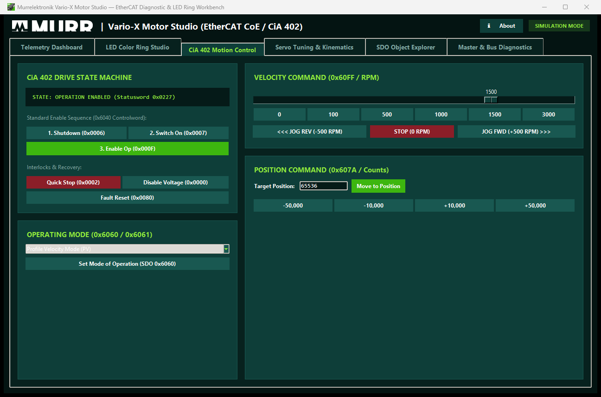
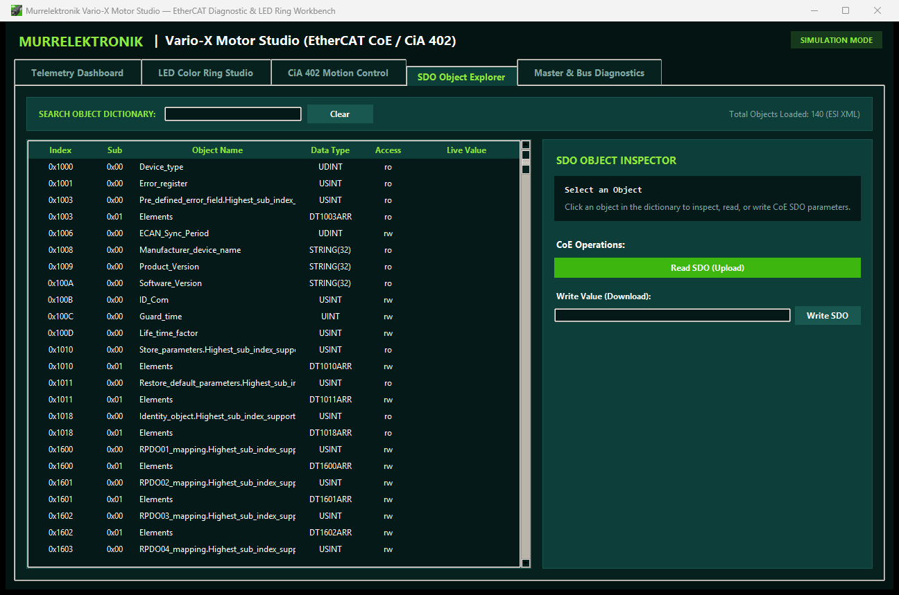
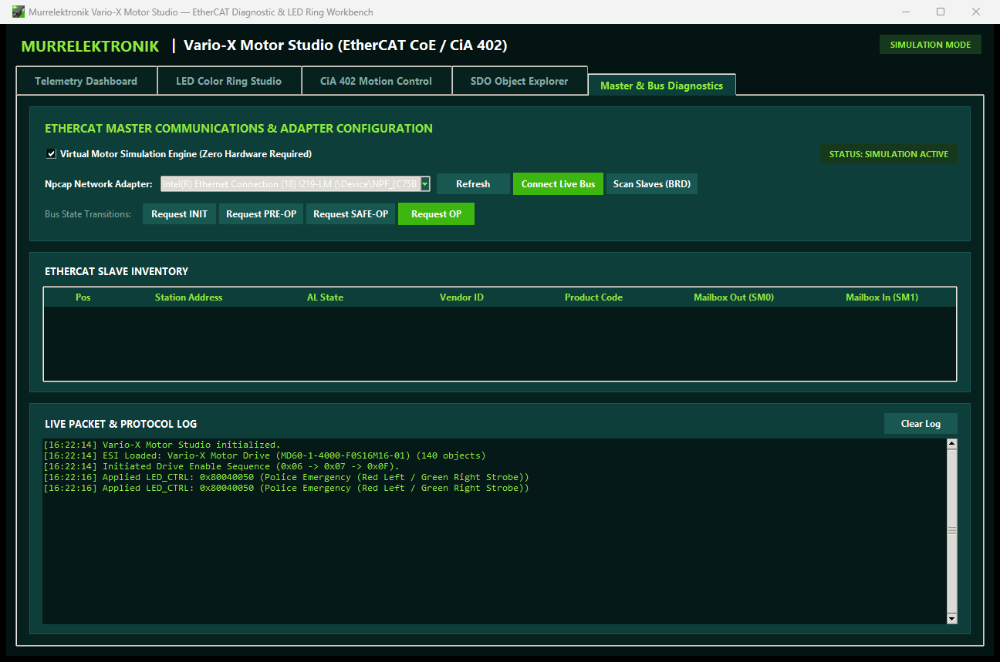

# Murrelektronik Vario-X Motor Studio 🛠️⚡


<p align="center">
  
</p>

An industrial diagnostic workbench, real-time telemetry dashboard, and optical LED ring synthesizer for **Murrelektronik Vario-X Servo Motor Drives** (`MD60-1-4000-F0S16M16-01`).

---

## 📸 Application Interface Gallery

### 1. Telemetry Dashboard (Live Gauges & Oscilloscope)
> Real-time 16-bit encoder position, speed, torque, DC bus voltage, temperature, and live 3-channel waveform oscilloscope.
<p align="center">
  
</p>

---

### 2. LED Color Ring Studio (Object `0x2FEF`)
> Full interactive control over the 32-bit optical status ring, color priority matrix, custom waveforms, and quick diagnostic presets.
<p align="center">
  
</p>

---

### 3. CiA 402 Motion & Drive State Controller *(⚠️ Untested on Live Hardware)*
> Complete servo state machine transitions (`Shutdown`, `Switch On`, `Enable Operation`, `Quick Stop`) and velocity/position setpoint targeting.  
> **Note:** *This section is currently implemented & simulated, but untested on live hardware.*
<p align="center">
  
</p>

---

### 4. CANopen SDO Object Explorer *(⚠️ Untested on Live Hardware)*
> Complete tree of 140+ ESI objects with real-time SDO Upload (read) and SDO Download (write) parameter editors.  
> **Note:** *This section is currently implemented & simulated, but untested on live hardware.*
<p align="center">
  
</p>

---

### 5. Master & Bus Diagnostics
> Layer-2 Npcap adapter selector, live slave scan table, SyncManager configuration inspection, and high-speed bus logger.
<p align="center">
  
</p>

---

## ✨ Key Capabilities

### 🏎️ Direct Raw EtherCAT Master (Layer-2 Npcap Engine)
- **Zero-overhead raw socket EtherCAT master** operating over Windows Npcap.
- Automatic slave discovery (`APWR`, `FPRD`, `FPWR`, `BRD`) and SyncManager (`SM0`, `SM1`) mailbox configuration.
- Transitions slaves through `INIT` $\to$ `PRE-OP` $\to$ `SAFE-OP` $\to$ `OP`.

### 🎯 High-Precision Encoder Feedback (16-bit Multiturn / Singleturn)
- Full 32-bit absolute position acquisition via CANopen object `0x6064:00`.
- Exact hardware calibration for **16-bit single-turn resolution ($65,536\,\text{counts/revolution}$)** and **16-bit multiturn range ($\pm 32,768\,\text{turns}$)**.
- Interactive angle dial indicator with zero-offset zeroing.

### 🌈 Optical LED Color Ring Studio (`Object 0x2FEF`)
- Full interactive control over the 32-bit `LED_CTRL` register (`0x2FEF:01`) and `LED_Status` (`0x2FEF:02`).
- 60 FPS real-time animated squircle faceplate simulator.
- Pre-configured industrial status presets (*Solid Green*, *Green Pulse*, *Caution Yellow*, *Critical Alarm Red*, *Emergency Strobes*).

### ⚙️ CiA 402 Servo State Machine & Motion Control *(⚠️ Untested on Live Hardware)*
- Direct control over Controlword (`0x6040`) and Statusword (`0x6041`).
- Implements the complete CiA 402 drive state transition graph.
- Motion modes: Profile Velocity (`PV`), Profile Position (`PP`), Cyclic Synchronous Velocity (`CSV`), Cyclic Synchronous Position (`CSP`).
- *(Implemented and verified in simulation; pending live physical drive commissioning)*

### 🔍 CANopen SDO Object Dictionary Explorer *(⚠️ Untested on Live Hardware)*
- Fully populated from official **Murrelektronik ESI XML** (`MD60-1-4000-F0S16M16-01`).
- 140+ documented manufacturer, CiA 402, and diagnostic objects (`0x1000`–`0x60FF`).
- *(Implemented and verified in simulation; pending live physical drive commissioning)*

### 🧪 Built-in Virtual Motor Simulation Engine
- Complete hardware-in-the-loop (HIL) mathematical physics simulator.
- Enables full testing of GUI features, LED ring sequences, CiA 402 transitions, and oscilloscope feedback offline.

---

## 🔌 Hardware Connector Layout & Technical Specs

| Connector | Port Name | Type / Pinout | Function |
| :--- | :--- | :--- | :--- |
| **`X1`** | Power Supply | **MQ15 Male (6-pin)** | 24V Logic (`US`), 48V Power (`UA`), STO (2 Channels) |
| **`X4`** | Digital Signal / Service | **M8 Female A-coded (4-pin)** | Digital Inputs/Outputs & Diagnostic Serial |
| **`X2 IN`** | EtherCAT Port IN | **M12 Female Y-coded (8-pin)** | 100 Mbit/s EtherCAT Industrial Bus Input |
| **`X3 OUT`** | EtherCAT Port OUT | **M12 Female Y-coded (8-pin)** | 100 Mbit/s EtherCAT Industrial Bus Daisy-Chain Output |

---

## 🚀 Quick Start Guide

### Prerequisites
- **Python 3.10+**
- **Npcap** (installed with *WinPcap API-compatible mode* enabled)
- Windows 10/11

### 1. Clone the Repository
```bash
git clone https://github.com/JTuttleMurrInc/me-variox-servo-motor-studio.git
cd me-variox-servo-motor-studio
```

### 2. Install Dependencies
```powershell
pip install -r requirements.txt
```

### 3. Launch the Application

#### 🟢 Live Hardware Mode (Connects to Physical Vario-X Motor)
```powershell
python app.py --live
```

#### 🟡 Simulation Mode (Offline Physics & SDO Simulator)
```powershell
python app.py --sim
```

---

## 📁 Repository Structure

```text
me-variox-servo-motor-studio/
├── app.py                      # Root Application Controller & Tkinter Lifecycle
├── capture_tabs.py             # Automated UI Screenshot Generator
├── create_icon.py              # Icon Asset Builder
├── live_workbench.py           # CLI Hardware Test Harness & Diagnostic Suite
├── requirements.txt            # Python Dependencies (Pillow, etc.)
│
├── assets/                     # Application Icons (ICO & PNG)
│   ├── app_icon.ico
│   └── app_icon.png
│
├── core/                       # EtherCAT & CiA 402 Core Engines
│   ├── ecat_raw.py             # Layer-2 Npcap Raw Ethernet Driver
│   ├── ecat_master.py          # High-Level Master, CoE Mailbox & Telemetry Poller
│   ├── esi_parser.py           # EtherCAT Slave Information (ESI) XML Parser
│   ├── led_ring.py             # 32-bit Object 0x2FEF LED Ring Math & Presets
│   ├── motor_device.py         # CiA 402 Data Structures & Telemetry Models
│   └── simulation.py           # Virtual Motor Drive Physics Engine
│
├── gui/                        # Modular Industrial User Interface
│   ├── theme.py                # Murrelektronik Color Tokens, Fonts, & Styles
│   ├── components/
│   │   ├── ring_widget.py      # Squircle Faceplate & Dual-Half LED Canvas
│   │   ├── gauge_widget.py     # 16-bit Position Feedback & Metric Cards
│   │   └── scope_chart.py      # Real-Time Oscilloscope Waveform Canvas
│   └── tabs/
│       ├── dashboard_tab.py    # Live Gauges, Status Indicators, & Controls
│       ├── led_studio_tab.py   # LED Ring Studio, Waveforms, & Presets
│       ├── motion_tab.py       # CiA 402 Motion & State Control
│       ├── sdo_explorer_tab.py # CoE Object Dictionary Tree & SDO Read/Write
│       └── diagnostics_tab.py  # EtherCAT Bus & SyncManager Diagnostics
│
├── tests/                      # Automated Unit Test Suite
│   ├── test_esi_parser.py
│   ├── test_led_ring.py
│   ├── test_motor_device.py
│   └── test_simulation.py
│
└── docs/                       # Screenshots & UI Visuals
    └── screenshots/
        ├── 01_telemetry_dashboard.png
        ├── 02_led_ring_studio.png
        ├── 03_cia402_motion.png
        ├── 04_sdo_explorer.png
        ├── 05_bus_diagnostics.png
        └── app_icon.png
```

---

## 🧪 Running Automated Tests

Run the test suite:
```powershell
python -m unittest discover tests
```

---

## 🏢 Author & Acknowledgments
- **Murrelektronik US Solutions Team**
- Application created for testing, commissioning, and showcasing Murrelektronik Vario-X decentralized automation systems.
